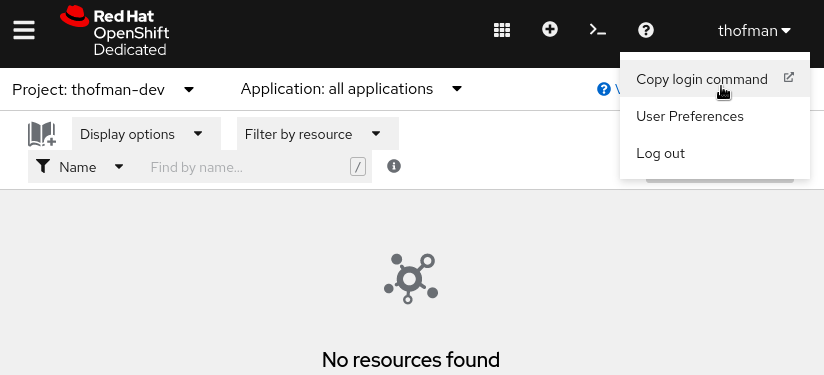

# Wildfly OpenShift Configuration Quickstart - Brief Version

This is the brief version of the readme. [Here is the talkative version.](README.md)

## Preparation

[Get access to an OpenShift cluster.](https://developers.redhat.com/developer-sandbox/get-started)

[Install `oc` command.](https://developers.redhat.com/openshift/command-line-tools)

[Install `helm` command.](https://helm.sh/docs/intro/install/)

Checkout this repository:
```shell
git clone git@github.com:TomasHofman/wildfly-openshift-configuration-example.git
cd wildfly-openshift-configuration-example/
```

Review the [pom.xml](pom.xml) (note the `wildfly-maven-plugin` configuration in the "openshift" profile).

Review the [JAX-RS endpoint source](src/main/java/org/wildfly/demo/HelloEndpoint.java)
(note it prints a DEBUG log message).

Review [openshift/wildfly-buildtime-config.cli](openshift/wildfly-buildtime-config.cli)
(the script configures Wildfly to add "powered-by: Wildfly" response headers).

## Optional - Run the App Locally

Compile the app and provision a Wildfly server instance:
```shell
mvn clean package -Popenshift
```

Run the server with deployed app:
```shell
./target/server/bin/standalone.sh
```

In new terminal, request the app JAX-RS endpoint:
```shell
curl -v localhost:8080/api/hello
# output should contain "powered-by: Wildfly" response header
```

Ctrl+C to terminate the app server.

## Deploy to an OpenShift Cluster

Review [openshift/helm.yaml](openshift/helm.yaml).

Review [openshift/wildfly-runtime-config.cli](openshift/wildfly-runtime-config.cli)
(the script configures Wildfly to print DEBUG log messages to standard output).

Obtain logging command:



Copy the loggin command & run in terminal:
```shell
oc login --token=<token> --server=<url>
```

Make sure you are in correct namespace:
```shell
oc project
# Example output:
Using project "thofman-dev" on server "https://api.sandbox.x8i5.p1.openshiftapps.com:6443".
```

Add Wildfly Helm Chart repository:
```shell
helm repo add wildfly http://docs.wildfly.org/wildfly-charts/
```

Optional - if Widfly Helm Chart repo was already present, update:
```shell
helm repo update wildfly
```

Check that the "wildfly/wildfly" chart is available in version 2.0.0 or newer:
```shell
helm search repo wildfly
# Expected output contains:
wildfly/wildfly                     	2.0.3        	           	Build and Deploy WildFly applications on OpenShift
```

Install the Helm Chart:
```shell
helm install example-wildfly-app -f openshift/helm.yaml wildfly/wildfly
```

Optional - review created Kubernetes resources:
```shell
oc get all --selector app.kubernetes.io/instance=example-wildfly-app
```

Watch build configs progress (terminate command with Ctrl+C when both build configs are "Complete"):
```shell
oc get build -w
```

Watch deployment progress (terminate command with Ctrl+C when readiness state shows "1/1"):
```shell
oc get deployment example-wildfly-app -w
```

## Access the App and Verify Configuration Took Effect

Determine application URL:
```shell
oc get route
# Example output:
NAME                  HOST/PORT                                                                   PATH   SERVICES              PORT    TERMINATION     WILDCARD
example-wildfly-app   example-wildfly-app-thofman-dev.apps.sandbox-m2.ll9k.p1.openshiftapps.com          example-wildfly-app   <all>   edge/Redirect   None
```

Request the app JAX-RS endpoint (URL is based on above output):
```shell
curl -v https://example-wildfly-app-thofman-dev.apps.sandbox-m2.ll9k.p1.openshiftapps.com/api/hello
# Output should contain "powered-by: Wildfly" response header.
```

Determine application pod name:
```shell
oc get pods
# Example output (the pod in "Running" state is the application pod):
NAME                                          READY   STATUS      RESTARTS   AGE
example-wildfly-app-2-build                   0/1     Completed   0          49m
example-wildfly-app-9dfcff86f-js5dv           1/1     Running     0          48m
example-wildfly-app-build-artifacts-1-build   0/1     Completed   0          52m
```

Show application logs:
```shell
oc logs example-wildfly-app-9dfcff86f-js5dv
# Output should end with the app DEBUG message:
...
08:28:55,101 DEBUG [org.wildfly.demo.HelloEndpoint] (default task-1) Received a /hello endpoint request
```