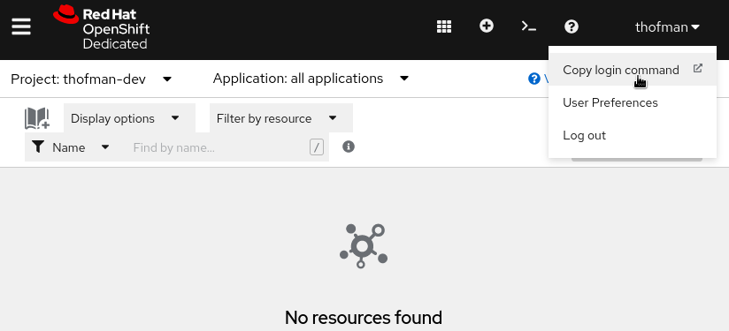

# Wildfly OpenShift Image Configuration Example

This quickstart demonstrates **how to deploy and configure the Wildfly application server on OpenShift**.
It is going to concentrate on how a Wildfly instance can be configured with a **Wildfly CLI
script** (rather than via environment variables). The quickstart leverages the new 
[Wildfly S2I v2 workflow](https://www.wildfly.org/news/2021/10/29/wildfly-s2i-v2-overview/), introduced in
[Wildfly 26](https://www.wildfly.org/news/2021/12/16/WildFly26-Final-Released/), which simplifies the deployment process
compared to S2I v1 workflow used in previous Wildfly releases.

Following technologies are used in this quickstart:

* [Wildfly 26](https://www.wildfly.org/news/2021/12/16/WildFly26-Final-Released/) (or later versions),
* [Wildfly Maven Plugin 3.x](https://github.com/wildfly/wildfly-maven-plugin/),
* [Wildfly S2I (Source to Image) v2](https://github.com/wildfly/wildfly-s2i/) container images,
* [wildfly Helm Charts 2.x](https://docs.wildfly.org/wildfly-charts/).

In following sections, we are going to:
1. Build an example application from this repository, provision a Wildfly server instance with the application deployed.
2. Prepare a simple Wildfly CLI configuration script, to modify the Wildfly server configuration.
3. Deploy the Wildfly instance on an OpenShift cluster in a way so that the configuration CLI script is applied to it
   automatically.

<!--
For comparison, the [pre-wildfly-26](tree/pre-wildfly-26) branch of this repository shows how the same result could be
achieved with earlier versions of Wildfly. Notably, a use of a Wildfly CLI script for the configuration of the Wildfly
instance, as opposed to configuration via environment variables, is much easier with the new workflow.
-->

## Prerequisites

Following is assumed:

* You have access to an OpenShift cluster. If you don't have access to a cluster, you can get a
temporary cluster for free on
the [Developer Sandbox for Red Hat OpenShift page](https://developers.redhat.com/developer-sandbox/get-started).
* The `oc` command is installed on your system (see [this article](https://developers.redhat.com/openshift/command-line-tools) on how to install it).
* The `helm` command is installed on your system (see [this article](https://helm.sh/docs/intro/install/) on how to install it).

## About the Example Application

The sample application in this repository contains a static [HTML page](src/main/webapp/index.html) and a 
[JAX-RS endpoint](src/main/java/org/wildfly/demo/HelloEndpoint.java). This is going to be important to know 
in order to determine which Galleon layers to include in the Wildfly server.

## Configuring the Wildfly Maven Plugin

As opose to the old Wildfly S2I workflow, the provisioning of the Wildfly server instance is now part of the Maven build
process. To provision a server instance, the [pom.xml](pom.xml) contains following section with configuration of the
[Wildfly Maven Plugin](https://github.com/wildfly/wildfly-maven-plugin/):

```xml
<plugin>
    <groupId>org.wildfly.plugins</groupId>
    <artifactId>wildfly-maven-plugin</artifactId>
    <version>3.0.0.Final</version>
    <configuration>
        <feature-packs>
            <feature-pack>
                <location>org.wildfly:wildfly-galleon-pack:${version.wildfly}</location>
            </feature-pack>
        </feature-packs>
        <!-- List of layers to build the application server from: -->
        <layers>
            <!-- The jaxrs-server layer provides JAX-RS API implementation -->
            <layer>jaxrs-server</layer>
            <!-- The microprofile-health layer provides microprofile health endpoints at
                 [server address]:9990/api/live and [server address]:9990/api/ready -->
            <layer>microprofile-health</layer>
        </layers>
        <galleon-options>
            <jboss-fork-embedded>true</jboss-fork-embedded>
        </galleon-options>
        <runtime-name>ROOT.war</runtime-name>
    </configuration>
    <executions>
        <execution>
            <goals>
                <goal>package</goal>
            </goals>
        </execution>
    </executions>
</plugin>
```

The configuration contains two important sections that determine which extensions are going to be included in the
provisioned server instance:

1. a list of feature packs (the `<feature-packs>` element),
2. and a list of layers (the `<layers>` element).

Explainer: A feature pack (aka a Galleon pack) is a package of functionalities (called layers) that can be used to
provision a Wildfly instances. These packs are packaged as Maven artifacts, and the provisioning tool downloads them from
a Maven repository. Which particular layers from given packs should be actually included in the provisioned instance can
be further limited in the `<layers>` element. If the element is not present, all layers from configured feature packs
are included. Limiting the number of layers will produce a smaller Wildfly instance in terms of disk space and 
memory footprint.

## Building the Application and Provisioning the Server

In this demo, the Wildfly Maven Plugin execution is part of the "openshift" Maven profile. That way, running 
`mvn clean package` only builds the application WAR, but doesn't provision a server instance.

In order to provision a Wildfly server instance with the application WAR deployed in it, it is needed to activate the
"openshift" profile:

```shell
$ mvn clean package -Popenshift
```

The provisioned server is created in the `target/server/` directory. You can run this server by executing following 
command:

```shell
$ ./target/server/bin/standalone.sh
```

To verify that the application is correctly deployed, you visit <http://localhost:8080/> in your browser. You should see
a simple "Hello" page with a link to the JAX-RS endpoint.

Note that the "openshift" Maven profile is also automatically activated in the Wildfly S2I workflow, which expects a
server instance to be provisioned by the Maven build.

## Preparing a CLI Configuration Script

With real life applications, it is usually necessary to configure the application server in a specific way for an
application to work. Common aspects that may require configuration are connections to database servers or messaging brokers,
integration with SSO servers, etc. The Wildfly S2I container images offer two ways how to perform configuration:

* via environment variables,
* via a Wildfly CLI script.

This section concentrates on the CLI script configuration. Advantages of using a CLI script are that:

1. more complex configurations can be achieved, compared to configuration via environment variables,
2. for people who are already used to working with Wildfly CLI, it may be more straightforward to define configuration
in this way.

For demonstrational purposes, a simple CLI script was created
in [openshift/wildfly-runtime-config.cli](openshift/wildfly-runtime-config.cli) which reconfigures Wildfly logging subsystem
to log DEBUG messages from our application to standard output. The CLI script contains these commands:

```
/subsystem=logging/logger=org.wildfly.demo:add(level=DEBUG)
/subsystem=logging/console-handler=CONSOLE:write-attribute(name=level, value=DEBUG)
```

### Create an OpenShift ConfigMap with the CLI Script

We need the CLI script to be available to the application containers. We don't want to make it part of the container
image however, because we assume that the file would contain environment specific configuration. (For instance, the
staging environment configuration can be different from the production enviornment configuration.)

In order to achieve that, we are going to create an OpenShift ConfigMap containing the script.

Firstly, log in to your cluster with the `oc` CLI tool. The login command can be obtained from the user menu of the
OpenShift Web Console:



The command looks like this:

```shell
$ oc login --token=<token string> --server=<cluster url>
```

Make sure you are in the right namespace:

```shell
oc project <namespace-name>
```

Then, create the ConfigMap:

```shell
$ oc create configmap wildfly-config --from-file openshift/wildfly-runtime-config.cli 
configmap/wildfly-config created
```

This ConfigMap would later be mounted to the application container filesystem, from where it can be read by the Wildfly
launcher script.

## Prepare a Helm Values File

The Helm values file is a configuration file for a Helm Chart. Values from this file are taken and substituted into
templates defined by a Helm Chart. The structure of the YAML file is dictated by the particular Helm Chart that is
being used. For the Wildfly Helm Chart case, you can check the README file in the 
[Wildfly Helm Chart GitHub repository](https://github.com/wildfly/wildfly-charts/blob/main/charts/wildfly/README.md) for
help.

In our case, the file is prepared at [openshift/helm.yaml](openshift/helm.yaml) and it contains this:

```yaml
build:
  # application source GIT repository:
  uri: https://github.com/TomasHofman/wildfly-openshift-configuration-example.git
  # repository branch:
  ref: main
  # should the application image be build (true) or should an existing image be used (false):
  enabled: true
  # mode can be either s2i or bootable-jar
  mode: s2i
  output:
    # where to push the created application image (DockerImage or ImageStreamTag):
    kind: ImageStreamTag
  s2i:
    # container image for building the application from source and provisioning the server (there is also a jdk17 variant)
    builderImage: 'quay.io/wildfly/wildfly-s2i-jdk11'
    # container image for the runtime (there is also a jdk17 variant)
    runtimeImage: 'quay.io/wildfly/wildfly-runtime-jdk11'
    version: latest
deploy:
  # the application image should be deployed: 
  enabled: true
  # application env variables:
  env:
    # path to CLI configuration script inside the application container (it has to be mounted under this path):
    - name: CLI_LAUNCH_SCRIPT
      value: /etc/wildfly/wildfly-runtime-config.cli
  # mount a ConfigMap to the filesystem:
  volumes:
    - name: wildfly-config
      configMap:
        name: wildfly-config
  volumeMounts:
    - name: wildfly-config
      mountPath: /etc/wildfly
  # create a TLS encrypted route for the application:
  route:
    enabled: true
    tls:
      enabled: true
      termination: edge
      insecureEdgeTerminationPolicy: Redirect
  # it's a good practice to define liveness & readiness probes, these endpoints are automatically available thanks to
  # the "microprofile-health" galleon layer we added into the provisioning config in the Wildfly Maven Plugin
  livenessProbe:
    httpGet:
      path: /health/live
      port: admin
  readinessProbe:
    httpGet:
      path: /health/ready
      port: admin
  startupProbe:
    failureThreshold: 36
    httpGet:
      path: /health/live
      port: admin
    initialDelaySeconds: 5
    periodSeconds: 5
  # number of application replicas (pods) that should be started:
  replicas: 1
```

## Deploying on OpenShift

We are going to use Wildfly Helm Chart to deploy our app on the OpenShift cluster.

1. Add the Wildfly Helm Charts repository to your Helm installation:
   ```shell
   $ helm repo add wildfly http://docs.wildfly.org/wildfly-charts/
   ```
   
   If you already had the "wildfly-chars" repo installed, it's a good idea to update it:
   ```shell
   $ helm repo update wildfly
   ```
   
   You can check that the "wildfly" chart is searchable:
   ```shell
   $ helm search repo wildfly
   wildfly/wildfly                     	2.0.3        	           	Build and Deploy WildFly applications on OpenShift
   [...]
   ```
   It's important that the chart version is 2.0.0 or higher.

2. Let `helm` create all the OpenShift resources necessary to build and deploy the application:
   ```shell
   $ helm install example-wildfly-app -f openshift/helm.yaml wildfly/wildfly
   ```
   This command should result in creation of multiple OpenShift resources. You can list them with the following `oc`
   command:
   ```shell
   $ oc get all --selector app.kubernetes.io/instance=example-wildfly-app
   NAME                               TYPE        CLUSTER-IP     EXTERNAL-IP   PORT(S)    AGE
   service/example-wildfly-app        ClusterIP   172.30.46.37   <none>        8080/TCP   2h
   service/example-wildfly-app-ping   ClusterIP   None           <none>        8888/TCP   28h

   NAME                                  READY   UP-TO-DATE   AVAILABLE   AGE
   deployment.apps/example-wildfly-app   1/1     1            1           2h

   NAME                                                                 TYPE     FROM         LATEST
   buildconfig.build.openshift.io/example-wildfly-app                   Docker   Dockerfile   2
   buildconfig.build.openshift.io/example-wildfly-app-build-artifacts   Source   Git@main     1

   NAME                                                                 IMAGE REPOSITORY                                                                                                                   TAGS     UPDATED
   imagestream.image.openshift.io/example-wildfly-app                   default-route-openshift-image-registry.apps.sandbox-m2.ll9k.p1.openshiftapps.com/thofman-dev/example-wildfly-app                   latest   2 hours ago
   imagestream.image.openshift.io/example-wildfly-app-build-artifacts   default-route-openshift-image-registry.apps.sandbox-m2.ll9k.p1.openshiftapps.com/thofman-dev/example-wildfly-app-build-artifacts   latest   2 hours ago

   NAME                                           HOST/PORT                                                              PATH   SERVICES              PORT    TERMINATION     WILDCARD
   route.route.openshift.io/example-wildfly-app   wildfly-v2-app-thofman-dev.apps.sandbox-m2.ll9k.p1.openshiftapps.com          example-wildfly-app   <all>   edge/Redirect   None
   ```
   
3. You can now watch the application being built (either in the OpenShift Web Console or via the `oc` command):

   ```shell
   $ oc get build
   NAME                                    TYPE     FROM          STATUS     STARTED         DURATION
   example-wildfly-app-build-artifacts-1   Source   Git@8f914f9   Complete   2 minutes ago   2m23s
   example-wildfly-app-1                   Docker   Dockerfile    Complete   About a minute ago   1m10s
   ```
   
   Both builds should end up with status "Complete" after a couple of minutes. After that, you can watch the deployment
   progress:

   ```shell
   oc get deployment
   NAME                  READY   UP-TO-DATE   AVAILABLE   AGE
   example-wildfly-app   1/1     1            1           2m
   ```
   When the AVAILABLE column turns to 1, the application should be ready to recieve requests.

4. Try to access the application. To learn the application URL, inspect the "route" resource:
   ```shell
   $ oc get route
   NAME                  HOST/PORT                                                                   PATH   SERVICES              PORT    TERMINATION     WILDCARD
   example-wildfly-app   example-wildfly-app-thofman-dev.apps.sandbox-m2.ll9k.p1.openshiftapps.com          example-wildfly-app   <all>   edge/Redirect   None
   ```
   In my case, the "example-wildfly-app-thofman-dev.apps.sandbox-m2.ll9k.p1.openshiftapps.com" string is the URL of my
   deployed application. Use your browser to visit the URL shown in your route, and click on the link to the 
   "/api/hello" JAX-RS endpoint. Make a couple of requests there.

5. Check output of your application pod, and it should contain the DEBUG messages printed by the JAX-RS endpoint:
   ```shell
   $ oc get pods
   NAME                                          READY   STATUS      RESTARTS   AGE
   example-wildfly-app-2-build                   0/1     Completed   0          12m
   example-wildfly-app-build-artifacts-1-build   0/1     Completed   0          14m
   example-wildfly-app-c978cdd69-xgsfc           1/1     Running     0          11m
   $ oc logs example-wildfly-app-c978cdd69-xgsfc
   [...]
   12:24:08,356 INFO [org.jboss.as] (Controller Boot Thread) WFLYSRV0025: WildFly Full 26.1.1.Final (WildFly Core 18.1.1.Final) started in 34201ms - Started 269 of 354 services (138 services are lazy, passive or on-demand) - Server configuration file in use: standalone.xml
   12:24:08,357 INFO [org.jboss.as] (Controller Boot Thread) WFLYSRV0060: Http management interface listening on http://0.0.0.0:9990/management
   12:24:08,357 INFO [org.jboss.as] (Controller Boot Thread) WFLYSRV0054: Admin console is not enabled
   13:07:34,653 DEBUG [org.wildfly.demo.HelloEndpoint] (default task-1) Received a /hello endpoint request
   13:07:35,747 DEBUG [org.wildfly.demo.HelloEndpoint] (default task-1) Received a /hello endpoint request
   ```
   
   The DEBUG messages at the end of the log indicate that the CLI configuration script was applied (DEBUG messages
   would not be present in this log otherwise).